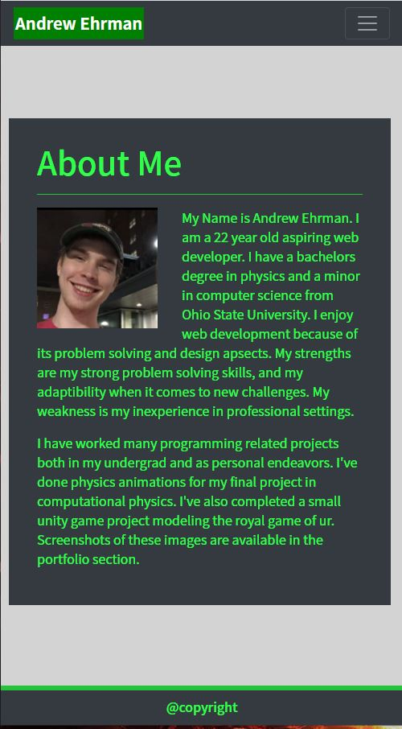
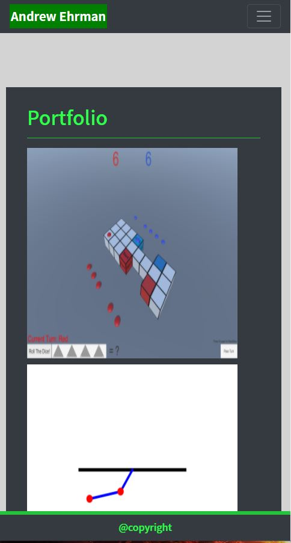
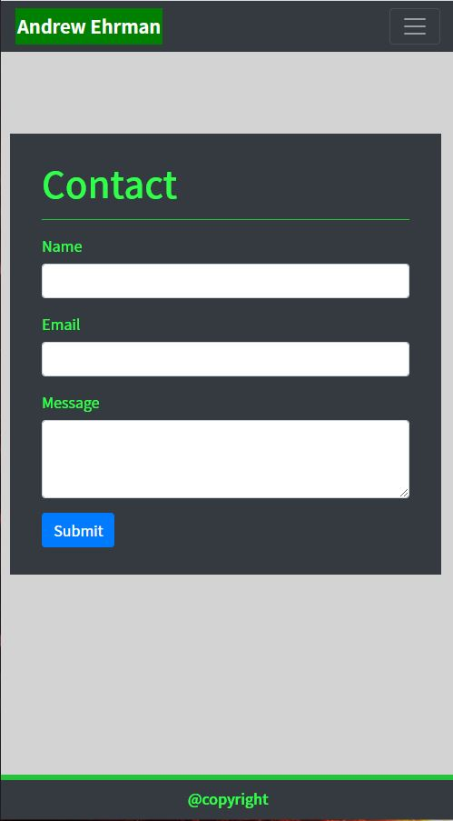

# ResponsivePortfolio

## Table of Contents
[Description](#description)

[Installation](#installation)

[Usage](#usage)

[Credits](#credits)

## Description
This github contains a portfolio framework. This portfolio uses bootstrap components in order to make a responsive page. The navbar navigates to 3 different htmls. Contact, Portfolio, and about me. Contact contains a non implemented form sheet. Portfolio contains pictures and gifs of past projects I have worked on. The following screen shots are at small screen size.

### About me (main)

### Portfolio

### Contact

## Usage
The page can be viewed at https://breakfastitem.github.io/ReactPortfolio/.

## Credits
Made By Andrew Ehrman.

### Components Used

 "@testing-library/jest-dom": "^5.11.9",

    "@testing-library/react": "^11.2.5",

    "@testing-library/user-event": "^12.8.3",

    "bootstrap": "^4.6.0",

    "react": "^17.0.1",

    "react-dom": "^17.0.1",

    "react-router-dom": "^5.2.0",

    "react-scripts": "4.0.3",

    "web-vitals": "^1.1.1"

     "gh-pages": "^3.1.0"